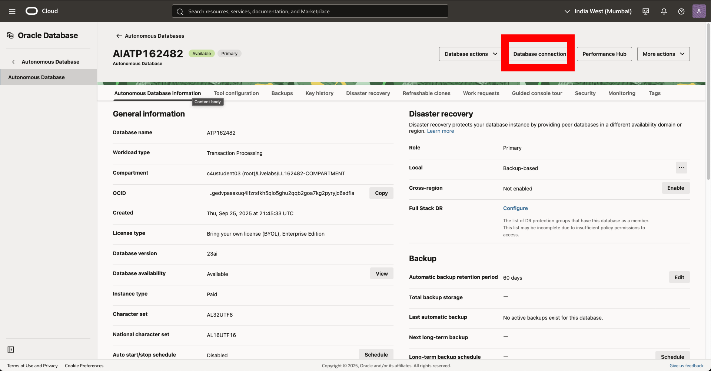
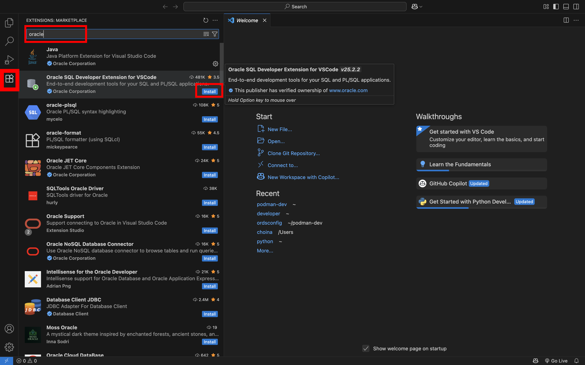
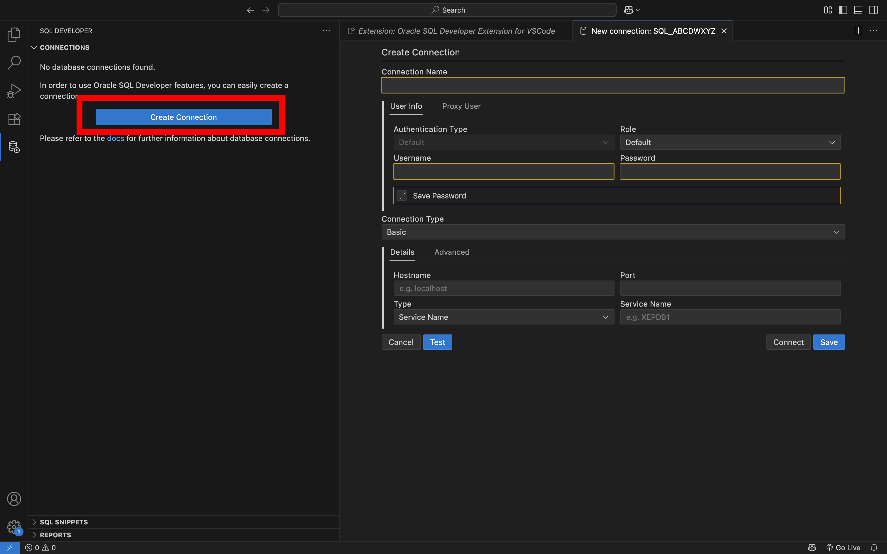
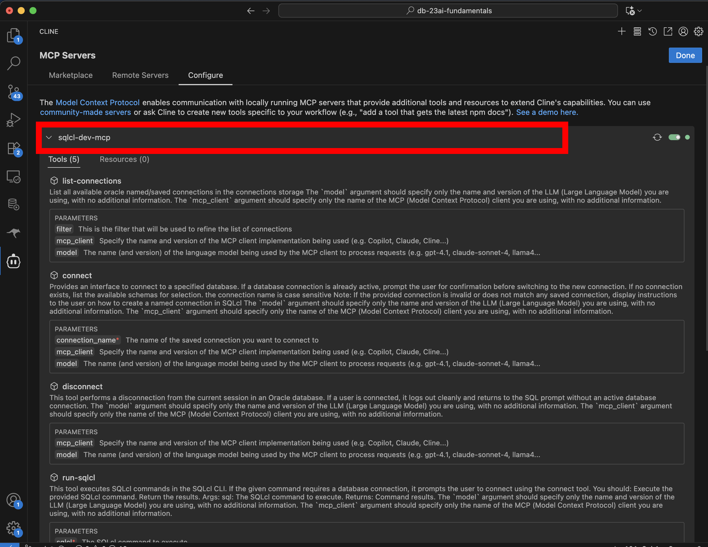
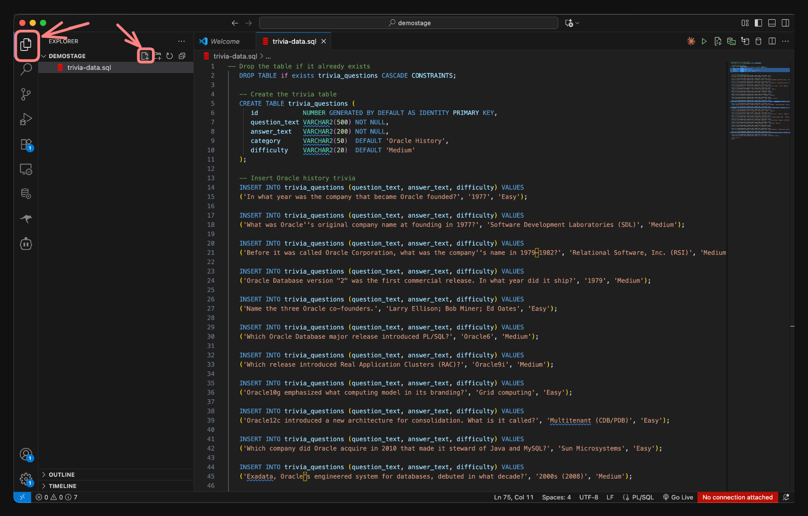

# Oracle SQLcl MCP Server with the Oracle Database

## Introduction

In this lab you’ll learn how to set up and use the SQLcl MCP Server with an AI agent in VS Code. The SQLcl MCP Server lets you securely connect your Oracle Database to an AI assistant—whether that’s Copilot, Cline, Claude Desktop, or any other tool that supports the Model Context Protocol (MCP).

For this simple demo, we’ll use VS Code and Copilot, but the steps work with other MCP-capable agents too. Once configured, you’ll use natural language to interact with your database, list connections, run SQL scripts, and even play a trivia game.

Estimated Lab Time: 20 minutes

### Objective:
By the end of this lab you will be able to:
- Download and configure SQLcl (with MCP support).
- Install and set up the SQL Developer and Cline extensions for VS Code.
- Connect to your Oracle Database using a wallet.
- Configure your MCP settings in VS Code.
- Use the SQLcl MCP server with an AI agent to list connections, run SQL, and create a trivia game table.


### Prerequisites:
This lab assumes you have:
- Oracle Java 17 or 21 installed.
- Access to an Oracle Database (FreeSQL, LiveSQL, or an Autonomous Database with wallet).
- Oracle account credentials.
- VS Code installed on your machine.


## Task 1: Download Your Wallet

1. From your Autonomous Database home page, **click** Database connection and download the database **Wallet**.  

   
   

2. Give the wallet a password. You can make your password anything you like, just don't forget it. (I suggest using the same password for the workshop) and click Download in the bottom right
    * Password: **OracleAIworld2025**

   


## Task 2: Install SQL Developer Extension for VS Code

1. Open VS Code and go to the **Extensions** view.  
2. Search for “Oracle SQL Developer” and click **Install**.  
   Or install directly from the [Marketplace](https://marketplace.visualstudio.com/items?itemName=Oracle.sql-developer).  

   

3. Once installed, open the SQL Developer Extension in the Activity Bar.  
   

4. Click **Create Connection** 
   

5. Enter your wallet connection details. Choose **Cloud Wallet** as the connection type, and select the wallet you downloaded earlier. Test the connection, then **Save**.  

      1. connection name: **AIWorld-HOL**
      2. username: **aiworld25**
      3. password: **OracleAIworld2025**
      4. **Cloud Wallet**

   

---

## Task 3: Install the Cline Extension

Cline is an MCP client extension for VS Code that lets you connect AI assistants (like Copilot Claude, Cline, Roo code, and many more) with MCP servers.

1. In VS Code Extensions, search for “Cline” and install it.  
   

2. Open Cline in the Activity Bar. 

3. First, click the gear icon to open cline settings. In this example, I'll show signing up with cline and using a free model. You can use and configure whatever API provider you prefer, including Oracle Code Assist. With Oracle code assist, you can authenticate with a valid Oracle SSO instead of an API key.

   

4. Once you've picked an API Provider (remember the mcp server works with any provider you pick), choose an AI model. Here I'll use a free model that cline offers. 

   

## Task 4: Install SQLcl

1. Now we'll install the MCP Server. Download SQLcl (25.2 or later) from the SQLcl download page or [click here](https://download.oracle.com/otn_software/java/sqldeveloper/sqlcl-latest.zip). The SQLcl tool is offered under [*Oracle Free Use License](https://www.oracle.com/downloads/licenses/oracle-free-license.html). You can also install via Homebrew (on Mac):  

2. If you downloaded the MCP using the link above, unzip the folder to a location. For the demo, I'll keep this in my downloads folder

   

## Task 5: Configure Cline with the SQLcl MCP Server

1. In VS Code, click the cline extension on the left hand side and click the **MCP Servers** icon at the top of the screen.  
   

2. Click **Configure MCP Servers**. This opens a JSON file.  
   

3. Replace the empty JSON with the following (update the path to your SQLcl install):  

      ```json
      <copy>
      {
         "mcpServers": {
            "sqlcl": {
               "command": "[UPDATE THIS WITH YOUR PATH]/bin/sql",
               "args": ["-mcp"]
            }
         }
      }
      </copy>
      ```
   

4. Save the file. You should see SQLcl appear under **Installed MCP Servers**.  
   

5. Click anywhere in the SQLcl bar to expand it. You'll see a list of SQLcl MCP Server "Tools", their parameters, and definitions. 

   

      <p></p>

      |Tool | Parameters | Definition |
      | --- | ---------- | ---------- | 
      | `list-connections` | <ul><li>`filter`</li><li>`mcp_client`</li><li>`model`</li></ul> | <ul><li>This is the filter that will be used to refine the list of connections</li><li>Specify the name and version of the MCP client implementation being used (e.g. Copilot, Claude, Cline...)</li><li>The name (and version) of the language model being used by the MCP client to process requests (e.g. gpt-4.1, claude-sonnet-4, llama4...</li></ul>|
      | `connect` | <ul><li>`connection_name`</li><li>`mcp_client`</li><li>`model`</li></ul> | <ul><li>Specify the name and version of the MCP client implementation being used (e.g. Copilot, Claude, Cline...)</li><li>The name (and version) of the language model being used by the MCP client to process requests (e.g. gpt-4.1, claude-sonnet-4, llama4...</li></ul>|
      | `disconnect` | <ul><li>`mcp_client`</li><li>`model`</li></ul> | <ul><li>The name of the saved connection you want to connect to</li><li>The name (and version) of the language model being used by the MCP client to process requests (e.g. gpt-4.1, claude-sonnet-4, llama4...</li></ul>|
      | `run-sqlcl` | <ul><li>`sqlcl`</li><li>`mcp_client`</li><li>`model`</li></ul> | <ul><li>The SQLcl command to execute</li><li>Specify the name and version of the MCP client implementation being used (e.g. Copilot, Claude, Cline...)</li><li>The name (and version) of the language model being used by the MCP client to process requests (e.g. gpt-4.1, claude-sonnet-4, llama4...</li></ul>|
      | `sql` | <ul><li>`sql`</li><li>`mcp_client`</li><li>`model`</li></ul> | <ul><li>The SQL query to execute</li><li>Specify the name and version of the MCP client implementation being used (e.g. Copilot, Claude, Cline...)</li><li>The name (and version) of the language model being used by the MCP client to process requests (e.g. gpt-4.1, claude-sonnet-4, llama4...</li></ul>|
      {: title="SQLcl MCP Server Tools"}


5. Click Done.

   


## Task 6: Using the MCP Server

1. Now we're ready to use the MCP Server. Notice the Plan and Act modes. You will toggle between these two modes depending on your intent and the prompts used. 

   

> &#9888; **IMPORTANT:** For adhering to security best practices, ensure the "Auto-Approve" option is disabled.


2. Enable **Plan** mode. Then, in the Task input area of Cline, enter the following prompt:

      ```text
      <copy>
      Using the sqlcl mcp server, list my database connections.
      </copy>
      ```
   

3. Cline will create a plan and respond by asking permission to use your SQLcl MCP Server via the `list-connections` tool. You should see something like this:

   

   > &#9872; **NOTE:** Note the tool name, followed by the arguments. In this case, Cline wants to "see" what database connections are available.

4. The output will return the list of connections available to the SQLcl MCP Server. Here we can see the AIWorld-HOL connection we made earlier in the lab

   


5. Now let’s use the `run-sqlcl` tool to execute a SQL script in your database. Copy the following script into a **new file in VS Code** named `trivia.sql`:   

   <details>
      <summary style="color: #0055ffff";><kbd style="font-size: 10px;">(click) </kbd><strong>SQL Script</strong></summary>
      <p></p>
      <button>
      <a href="./trivia-data.sql" target="_self" download="trivia-data.sql">Download .sql file</a>
      </button>
      <p></p>
    
      ```sql
      <copy>
         -- Drop the table if it already exists
         DROP TABLE if exists trivia_questions CASCADE CONSTRAINTS;

         -- Create the trivia table
         CREATE TABLE trivia_questions (
            id            NUMBER GENERATED BY DEFAULT AS IDENTITY PRIMARY KEY,
            question_text VARCHAR2(500) NOT NULL,
            answer_text   VARCHAR2(200) NOT NULL,
            category      VARCHAR2(50)  DEFAULT 'Oracle History',
            difficulty    VARCHAR2(20)  DEFAULT 'Medium'
         );

         -- Insert Oracle history trivia
         INSERT INTO trivia_questions (question_text, answer_text, difficulty) VALUES
         ('In what year was the company that became Oracle founded?', '1977', 'Easy');

         INSERT INTO trivia_questions (question_text, answer_text, difficulty) VALUES
         ('What was Oracle''s original company name at founding in 1977?', 'Software Development Laboratories (SDL)', 'Medium');

         INSERT INTO trivia_questions (question_text, answer_text, difficulty) VALUES
         ('Before it was called Oracle Corporation, what was the company''s name in 1979–1982?', 'Relational Software, Inc. (RSI)', 'Medium');

         INSERT INTO trivia_questions (question_text, answer_text, difficulty) VALUES
         ('Oracle Database version "2" was the first commercial release. In what year did it ship?', '1979', 'Medium');

         INSERT INTO trivia_questions (question_text, answer_text, difficulty) VALUES
         ('Name the three Oracle co-founders.', 'Larry Ellison; Bob Miner; Ed Oates', 'Easy');

         INSERT INTO trivia_questions (question_text, answer_text, difficulty) VALUES
         ('Which Oracle Database major release introduced PL/SQL?', 'Oracle6', 'Medium');

         INSERT INTO trivia_questions (question_text, answer_text, difficulty) VALUES
         ('Which release introduced Real Application Clusters (RAC)?', 'Oracle9i', 'Medium');

         INSERT INTO trivia_questions (question_text, answer_text, difficulty) VALUES
         ('Oracle10g emphasized what computing model in its branding?', 'Grid computing', 'Easy');

         INSERT INTO trivia_questions (question_text, answer_text, difficulty) VALUES
         ('Oracle12c introduced a new architecture for consolidation. What is it called?', 'Multitenant (CDB/PDB)', 'Easy');

         INSERT INTO trivia_questions (question_text, answer_text, difficulty) VALUES
         ('Which company did Oracle acquire in 2010 that made it steward of Java and MySQL?', 'Sun Microsystems', 'Easy');

         INSERT INTO trivia_questions (question_text, answer_text, difficulty) VALUES
         ('Exadata, Oracle’s engineered system for databases, debuted in what decade?', '2000s (2008)', 'Medium');

         INSERT INTO trivia_questions (question_text, answer_text, difficulty) VALUES
         ('Oracle Autonomous Database was first announced in which year?', '2017', 'Medium');

         INSERT INTO trivia_questions (question_text, answer_text, difficulty) VALUES
         ('Oracle Application Express (APEX) first launched under a different name. What was it?', 'HTML DB', 'Medium');

         INSERT INTO trivia_questions (question_text, answer_text, difficulty) VALUES
         ('What is the internal name for the relational engine that inspired Oracle''s original product name?', 'Oracle (from a CIA project codename)', 'Hard');

         INSERT INTO trivia_questions (question_text, answer_text, difficulty) VALUES
         ('Oracle7 (early 1990s) became famous for which features (name one)?', 'Stored procedures, triggers, cost-based optimizer (any one)', 'Medium');

         INSERT INTO trivia_questions (question_text, answer_text, difficulty) VALUES
         ('Which release family introduced Automatic Storage Management (ASM)?', 'Oracle10g', 'Medium');

         INSERT INTO trivia_questions (question_text, answer_text, difficulty) VALUES
         ('Which release family introduced Active Data Guard?', 'Oracle11g', 'Medium');

         INSERT INTO trivia_questions (question_text, answer_text, difficulty) VALUES
         ('The first SQL*Net/Net8 predecessors enabled what key capability for Oracle databases?', 'Client/server network connectivity to the DB over protocols', 'Hard');

         INSERT INTO trivia_questions (question_text, answer_text, difficulty) VALUES
         ('Oracle''s first relational database was heavily influenced by research from which IBM scientist?', 'Edgar F. Codd', 'Medium');

         INSERT INTO trivia_questions (question_text, answer_text, difficulty) VALUES
         ('Which Oracle release name introduced the concept of "c" for cloud?', 'Oracle12c', 'Easy');

         -- Save the data
         COMMIT;

      </copy>
      ```

   </details>

     <p></p>

   

2. In Cline, run the script with the `run-sqlcl` tool, specifying your connection.  

      ```text
      <copy>
      use the run-sqlcl command to load the @/trivia-data.sql into the AIWorld-HOL database connection 
      </copy>
      ```

7. Cline will use the run-sqlcl tool to execute SQLcl commands on your behalf. Different LLMs will do different things; it's up to **YOU** to review what the coding agent wants to do and either approve, modify, or deny each request. Here I'll allow it to use SQLcl and run the script, adding the data to my database.

   

8. Now we have some data, let's ask the coding agent to build us a simple application based on our data.

   First, put Cline back into the plan mode.

      ```text
      <copy>
      Now build me a simple trivia web application for a conference presentation. The app should display the questions and data we stored in the database. For the sake of simplicity, make a static site. 
      </copy>
      ```
      


&#9888; **Warning:** It is very important that you review the SQL, or update your prompt to include the exact SQL you want the Agent to use.

9. As a best practice, you should prompt Cline to close your database connection when you are finished. Cline will prompt you for permission to use the disconnect tool. Click Approve.

10. Optionally, you can review a log of the queries performed by the SQLcl MCP Server on behalf of the AI Agent. The table is DBTOOLS$MCP_LOG. Table will capture the SQL, PLSQL, and SQL scripts that gets executed on your behalf (via Cline or any AI used), by the SQLcl MCP Server.

   Interested in learning more? 

   Check out the full MCP Session **Agentic AI for the Oracle Database via Our MCP Server (Offering 2) [HOL3088]**  Thursday, Oct 16
   9:00 AM - 10:30 AM PDT

## Clean Up

If you’d like to reset your environment, drop the table as follows:  

```sql
<copy>
DROP TABLE trivia_questions PURGE;
</copy>
```

---

## Learn More


* [MCP Server Introduction](https://blogs.oracle.com/database/post/introducing-mcp-server-for-oracle-database) 
* [Oracle official MCP Server repository](https://github.com/oracle/mcp/tree/main)
* [SQLcl MCP Server Docs](https://docs.oracle.com/en/database/oracle/sql-developer-command-line/25.2/sqcug/using-oracle-sqlcl-mcp-server.html)

---

## Acknowledgements
* **Author** – Killian Lynch, Oracle Database Product Management  
* **Contributors** – Chris Hoina, Jeff Smith - Database Tools 
* **Last Updated By/Date** – Killian, September 2025  
